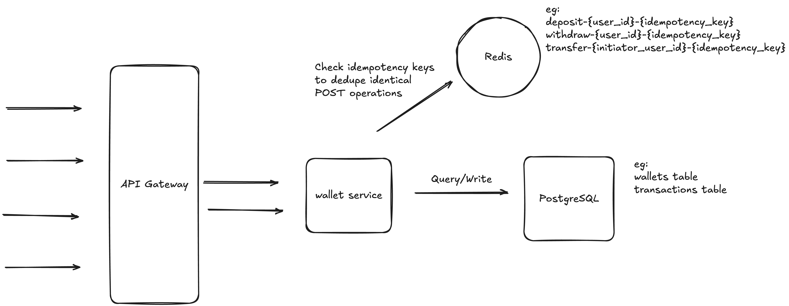

# Crypto Assignment

## Introduction

This is an API service written in <bold>Go</bold>, coupled with <bold>Gin</bold> framework with <bold>Docker</bold> setup. All APIs documentation are defined and generated with <bold>OpenAPI specs 3.0 swagger</bold> tools.

For the purpose of the assignment, it's decided that, to support all functional requiremenets (user stories required in assignment) with the APIs required, this wallet will only deal with wallet-related operations, `(get balance, deposit, withdraw, transfer & transactions history retrieval)`. Only `user_id` is stored on our wallet service for relation with users. It's best to keep user-related functionalities such as user profile details, user auth etc in another service for clear responsibility segregation between two domains.

## Prerequisites & Steps

1. Make sure to install Go locally. The latest version `1.24` will do
2. Make sure you have docker installed locally. If not, you will need to install Postgresql separately to spin up the database.
3. Assume that you are on Mac and have `homebrew` installed, run `brew install golang-migrate` for migrations and `brew install golangci-lint` for linting.
3. Run `make run` to start our API service as well as PostgreSQL, Redis on docker containers.
4. Once all services are up and running, run `make migrate_up` to initalise our data migrations for all tables required.
5. Run `make seed_data` to have some initial data seed for user wallets.
6. Head to `http://localhost:8080/swagger/index.html` to view all API available.
7. When you're done with testing, run `make stop` to shut down all services.

## System Design

At its core, this API service serves as the source of truth for all user wallets balances as well as its transactions history records. 

We use PostgreSQL database for primary storage for its ACID properties and transactions capabilities to commit or rollback atomic transactions. We also utilize PostgreSQL's MVCC architecture such as using row-level locking capabilities to allow concurrent reads while making sure we are able to lock certain rows for updates purposes. 

As network is always unreliable, all of our POST APIs (deposit, withdraw or transfer APIs, which are required to processed <bold>exactly once</bold> by our service) are built with idempotency design to allow for safe retries. As such, callers will need to provide idempotency keys as part of request header `X-IDEMPOTENCY-KEY` and we cache these keys in Redis (with <bold>TTL: 24 hours</bold>) to deduplicate identical requests. TTL of 24 hours is chosen as a balanced trade off between storage and business requirements 

Here we include a simple diagram to demonstrate our high-level system overview:



For the purpose of this assignment, the technical architecture such as API Gateway, how we deploy our services (on Kubernetes) etc, microservices setup etc is not included for discussion.

## Money format

Our wallet service stores money in cents unit to ensure precision and avoid problems when dealing with floating points. As such, all money units are in `uint64` cents format, and when converting / displaying in API responses, our wallet service will return in dollars amount in stringified version. For example, 100 cents will be displayed as "1.00" or 125 cents as "1.25".

## API Design

For a more interactive experience, you can refer to `http://localhost:8080/swagger/index.html` for swagger API tool.

All APIs provide querying, depositing, withdrawing or transfering wallets' balances with `X-USER-ID` header as well as some APIs (which must be processed <bold>exactly once</bold> eg: POST requests) with `X-IDEMPOTENCY-KEY` header.

Our APIs also follow the <bold>Restful</bold> design with appriopriate <bold>status codes</bold>, <bold>JSON responses</bold> and <bold>versioning</bold> for robust API designs.

Here we will briefly go through some key points of the APIs;

1. `GET /api/v1/wallet` 

Header
- `X-USER-ID`

Responses
- `200 OK`

```json
{
    "id": "a1bc19dc-f110-4d69-a755-96554be3dee5",
    "user_id": "59d8d8e6-452d-4f58-b090-1bb6e0dbb1ab",
    "balance": "1.00",
    "created_at": "2025-05-13T12:26:59.459081Z"
}
```
- `400 BAD REQUEST` , eg invalid user_id
- `404 NOT FOUND`, eg no wallet found
- `500 INTERNAL SERVER ERROR` eg server related errors

2. `GET /api/v1/wallet/transactions?page=1&pageSize=10`

Header
- `X-USER-ID`

Responses
- `200 OK`

```json
{
    "transactions": [
        {
            "id": "6f56f7f5-022a-427c-b0e1-9d3d4d841289",
            "initiator_wallet_user_id": "59d8d8e6-452d-4f58-b090-1bb6e0dbb1ab",
            "amount": "1.00",
            "type": "transfer",
            "status": "success",
            "recipient_wallet_user_id": "97889db9-9784-4018-aaf5-b8017197e6b5",
            "created_at": "2025-05-13T12:50:39.101388Z"
        },
        {
            "id": "c7cf7112-049f-4a4c-bcac-b1202b2737fa",
            "initiator_wallet_user_id": "59d8d8e6-452d-4f58-b090-1bb6e0dbb1ab",
            "amount": "1.25",
            "type": "withdraw",
            "status": "success",
            "created_at": "2025-05-13T12:46:53.713914Z"
        },
        {
            "id": "9dc503af-2c13-412a-bb60-a7741ee8ac28",
            "initiator_wallet_user_id": "59d8d8e6-452d-4f58-b090-1bb6e0dbb1ab",
            "amount": "1.25",
            "type": "deposit",
            "status": "success",
            "created_at": "2025-05-13T12:44:41.853495Z"
        }
    ],
    "page": 1,
    "page_size": 10,
    "total": 3,
    "total_pages": 1
}
```
- `400 BAD REQUEST` , eg invalid user_id
- `404 NOT FOUND`, eg no wallet found
- `500 INTERNAL SERVER ERROR` eg server related errors

3. `POST /api/v1/wallet/deposit` 

Description: Deposit API is idempotent in nature and provides `exactly-once` semantics. Safe retries with identical requests within 24 hours.

Header
- `X-USER-ID`
- `X-IDEMPOTENCY-KEY`

Request

```json
{
  "amount": 100 // in cents format
}
```
Response

- `200 OK`
```json
{
  "transaction_id": "9dc503af-2c13-412a-bb60-a7741ee8ac28"
}
```
- `400 BAD REQUEST` , eg invalid user_id
- `404 NOT FOUND`, eg no wallet found
- `500 INTERNAL SERVER ERROR` eg server related errors

4. `POST /api/v1/wallet/withdraw` 

Description: Withdraw API is idempotent in nature and provides `exactly-once` semantics. Safe retries with identical requests within 24 hours.

Header
- `X-USER-ID`
- `X-IDEMPOTENCY-KEY`

Request

```json
{
  "amount": 100 // in cents format
}
```
Response

- `200 OK`
```json
{
  "transaction_id": "c7cf7112-049f-4a4c-bcac-b1202b2737fa"
}
```
- `400 BAD REQUEST` , eg invalid user_id
- `404 NOT FOUND`, eg no wallet found
- `422 UNPROCESSABLE ENTITY`, eg insufficient wallet balance
- `500 INTERNAL SERVER ERROR` eg server related errors

5. `POST /api/v1/wallet/transfer` 

Description: Transfer API is idempotent in nature and provides `exactly-once` semantics. Safe retries with identical requests within 24 hours.

Header
- `X-USER-ID`
- `X-IDEMPOTENCY-KEY`

Request
```json
{
  "amount": 50, // in cents format
  "recipient_user_id": "97889db9-9784-4018-aaf5-b8017197e6b5"
}
```

Response
- `200 OK`
```json
{
  "transaction_id": "6f56f7f5-022a-427c-b0e1-9d3d4d841289"
}
```
- `400 BAD REQUEST` , eg invalid user_id
- `404 NOT FOUND`, eg no wallet found
- `422 UNPROCESSABLE ENTITY`, eg insufficient wallet balance
- `500 INTERNAL SERVER ERROR` eg server related errors

## Code architecture

Our code architecture follows the clean code architecture design, with clear separation between domain, service, repository, handler etc. We use interface for dependencies injection between layers for ease of mocking on unit tests.

All codes are formatted with `gofmt` and linted with `golangci-lint` linter. Simply run `make lint` to check for lint issues. As such, any other linters configurations can be tweaked at `.golangci.yaml` for preferences.

## Database design 

We assume that each user has only one unique wallet and wallet's balance can never be negative.

```sql
CREATE SCHEMA crypto;

-- Enums
CREATE TYPE crypto.transaction_type AS ENUM ('deposit', 'withdraw', 'transfer');
CREATE TYPE crypto.transaction_status AS ENUM ('success', 'failed');

-- wallets table
CREATE TABLE crypto.wallets (
    id UUID PRIMARY KEY DEFAULT uuid_generate_v4(),
    user_id UUID UNIQUE NOT NULL,
    balance BIGINT NOT NULL CHECK (balance >= 0),
    created_at TIMESTAMP NOT NULL DEFAULT NOW()
);

-- transactions table
CREATE TABLE crypto.transactions (
    id UUID PRIMARY KEY,
    initiator_wallet_id UUID NOT NULL REFERENCES crypto.wallets(id),
    type crypto.transaction_type NOT NULL,
    status crypto.transaction_status NOT NULL,
    amount BIGINT NOT NULL CHECK (amount > 0),
    recipient_wallet_id UUID REFERENCES crypto.wallets(id),
    created_at TIMESTAMP NOT NULL DEFAULT NOW()
);
```

After analyzing our queries usage pattern, several indexes can be added for optimization

```sql
CREATE INDEX idx_transactions_initiator_wallet_id ON crypto.transactions(initiator_wallet_id);
CREATE INDEX idx_transactions_recipient_wallet_id ON crypto.transactions(recipient_wallet_id);
CREATE INDEX idx_transactions_created_at ON crypto.transactions(created_at DESC);
```

Most of the operations like deposit, withdraw or transfer etc, we use PostgreSQL database transactions to achieve atomic transactions for `commit` and `rollback` if necessary. PostgreSQL's MVCC architecture allows for row-level locking capabilities which helps in boosting concurrency inside database while maintaining strong ACID properties. 

We use row-level locking `SELECT ... FOR UPDATE` on certain transactions such as transfer, where we lock both user wallets- involved rows and perform the transfer. Such row-level locking doesn't block on reads hence it's essential for high concurrency capabilities (which PostgreSQL provides :D)

## Redis Design

Redis is used mainly for caching idempotency keys. Each API calls for deposit, withdraw or transfer is an operation that must be idempotent (processed <bold>exactly once</bold>) in nature. As such, callers must supply UUID idempotency key for each operations for safe retries in case server returns errors that are server-side or unidentifiable due to the unstable nature of network.  

Internally, our API service takes each idempotency UUID key and checks if it exists in Redis, if it does it means the operation has already succeeded, we just return the cached transaction ID without doing anything. If not, proceed with the operation and cache the key with <bold>TTL of 24 hours</bold> to avoid double processing in future.

Some examples of idempotency keys caching in wallet service;
1. `deposit-userID-idempotencyKey`
2. `withdraw-userID-idempotencyKey`
3. `transfer-initiatorUserID-idempotencyKey` 

## Unit tests

Unit tests are added at domain, service and repository layers where most business logic resides.

We use `gomock` for mocking dependencies at different layers. Run `go install github.com/golang/mock/mockgen@v1.6.0` to get mockgen binary. You can find details usage at https://github.com/golang/mock.

Run `make unit_test` to run the entire unit tests suites. Our unit tests are written in <bold>table-driven format</bold> as recommended by Golang community https://go.dev/wiki/TableDrivenTests.

To see visualization for each file on unit test coverage, run `make unit_test_vis`.

## Optimization (Good to have)

1. Monitoring & Observability

Currently, we only have logging implemented for logging any errors from our API service. It would be good to also hook up some monitoring capabilities like Grafanna/Prometheus stack;

- Latency (P99, P95, P50)
- RPS/QPS
- Error rates on endpoints
- Availability on endpoints (successful requests / total requests), here successful requests are requests without 500 and above status code etc.

2. Use seek pagination (keyset pagination) on GET transactions history endpoint

Currently, we use the typical offset and pageSize pagination query. We should opt for seek pagination method which will be fast even with table with huge amount of records. For example,

```sql
SELECT 
    t.id,
    iw.user_id AS initiator_wallet_user_id,
    t.type,
    t.status,
    t.amount,
    rw.user_id AS recipient_wallet_user_id,
    t.created_at
FROM transactions t
JOIN wallets iw ON t.initiator_wallet_id = iw.id
LEFT JOIN wallets rw ON t.recipient_wallet_id = rw.id
WHERE iw.user_id = $1 OR rw.user_id = $1
AND (t.created_at, t.id) < ($2, $3) -- last seen created_at and id
ORDER BY t.created_at DESC, t.id DESC
LIMIT $4;
```
For the sake of this assignment, offset and pageSize pagination will do just fine. However, if this project were to scale, a proper seek pagination will be more appriopriate.
